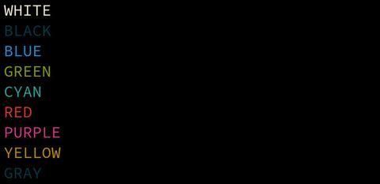

# echo

`echo` &#8212; это оболочка, встроенная в Bash и большинство других популярных оболочек, таких как Zsh и Ksh. Его поведение немного отличается от оболочки к оболочке.

Существует также отдельная утилита `/usr/bin/echo` , но обычно встроенная версия оболочки имеет приоритет. Мы рассмотрим встроенную в Bash версию `echo` .

Синтаксис команды `echo` следующий:

```echo [-neE] [ARGUMENTS]```

Когда используется опция `-n` , завершающий символ новой строки подавляется.

 Если задана опция `-e` будут интерпретироваться следующие символы, экранированные обратной косой чертой:

- `\` - отображает обратную косую черту
- `a` - Предупреждение (BEL
- `b` - отображает символ возврата
- `c` - подавить любой дальнейший вывод
- `e` - отображает escape-символ
- `f` - отображает символ перевода страницы
- `n` - отображает новую строку
- `r` - отображает возврат каретки
- `t` - отображает горизонтальную вкладку
- `v` - отображает вертикальную вкладку


Параметр `-E` отключает интерпретацию escape-символов. Это значение по умолчанию.

При использовании команды `echo` следует учитывать несколько моментов.

Оболочка заменит все переменные, сопоставление подстановочных знаков и специальные символы перед передачей аргументов команде `echo` .

Хотя это и не обязательно, рекомендуется заключать аргументы, передаваемые в `echo` в двойные или одинарные кавычки.

При использовании одинарных кавычек `&#39;&#39;` буквальное значение каждого символа, заключенного в кавычки, будет сохранено. Переменные и команды расширяться не будут.

## Примеры

В следующих примерах показано, как использовать команду echo:

**Вывести строку текста на стандартный вывод.**



```Hello, World!```


### Отобразите строку текста, содержащую двойные кавычки

 Чтобы напечатать двойную кавычку, заключите ее в одинарные кавычки или экранируйте символ обратной косой черты.



```Hello &quot;Linuxize&quot;```


### Отобразите строку текста, содержащую одинарную кавычку

Чтобы напечатать одинарную кавычку, заключите ее в двойные кавычки или используйте кавычки <a target="_blank" rel="nofollow" href="https://routerus.com/goto/https://www.gnu.org/software/bash/manual/html_node/ANSI_002dC-Quoting.html"  rel="noopener" target="_blank">ANSI-C</a> .



```I&#39;m a Linux user.```


### Вывести сообщение, содержащее специальные символы

 Используйте параметр `-e` чтобы включить интерпретацию escape-символов.


```You know nothing, Jon Snow. - Ygritte```


### Символы соответствия шаблону

Команда `echo` может использоваться с символами сопоставления с образцом, такими как подстановочные знаки. Например, приведенная ниже команда вернет имена всех файлов `.php` в текущем каталоге.


```The PHP files are: index.php contact.php functions.php```


**Перенаправить в файл**

Вместо отображения вывода на экране вы можете перенаправить его в файл с помощью операторов `&gt;` , `&gt;&gt;` .



Если файл file.txt не существует, команда создаст его. При использовании `&gt;` файл будет перезаписан, а <a href="/bash-append-to-file/">символ</a> `&gt;&gt;` <a href="/bash-append-to-file/">добавит вывод в файл</a> .

Используйте команду <a href="/linux-cat-command/">`cat`</a> для просмотра содержимого файла:



```The only true wisdom is in knowing you know nothing. Socrates```

**Отображение переменных**

`echo` также может отображать переменные. В следующем примере мы напечатаем имя текущего вошедшего в систему пользователя:



```linuxize```


`$USER` &#8212; это <a href="/how-to-set-and-list-environment-variables-in-linux/">переменная оболочки, в</a> которой хранится ваше имя пользователя.


**Отображение вывода команды**

Используйте выражение `$(command)` чтобы включить вывод команды в аргумент `echo` . Следующая команда отобразит <a href="/linux-date-command/">текущую дату</a> :

{% include cl.htm cmd="echo &quot;The date is: $(date +%D)&quot;" %}

```The date is: 04/17/19```

**Отображение в цвете**

Используйте <a target="_blank" rel="nofollow" href="https://routerus.com/goto/https://en.wikipedia.org/wiki/ANSI_escape_code#Colors"  rel="noopener" target="_blank">escape-последовательности ANSI,</a> чтобы изменить цвета переднего плана и фона или установить свойства текста, такие как подчеркивание и полужирный шрифт.





















