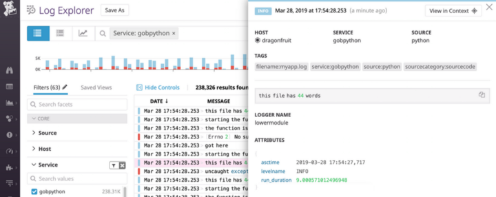
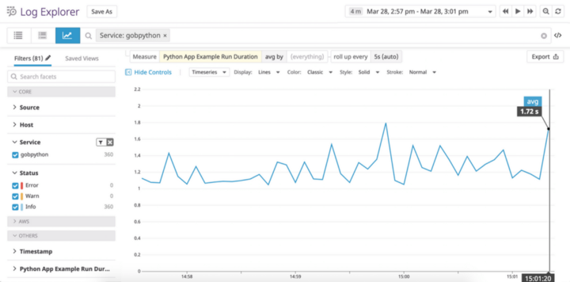
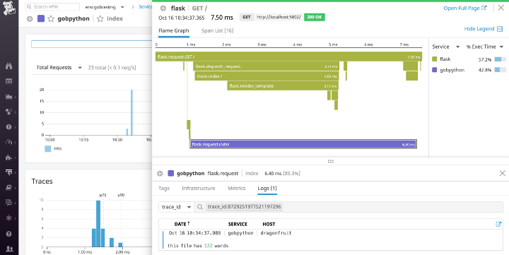

# Логи в Python. Налаштування та централізація

[How to collect, customize, and centralize Python logs](https://www.datadoghq.com/blog/python-logging-best-practices/)

https://nuancesprog.ru/p/5980/

## Вступ

Вбудований модуль Python `logging` розроблений для того, щоб дати вам детальне уявлення про програми з мінімальними налаштуваннями. Чи починаєте ви роботу або вже працюєте, у посібнику ви побачите, як налаштувати цей модуль, щоб допомогти знайти потрібний рядок коду.

У цьому пості ми покажемо вам, як:

- Налаштувати пріоритет та розташування журналів.
- Створити налаштування користувача, що включають кілька логерів і адресатів.
- Додати трасування винятків у логи.
- Відформатувати логі в JSON та централізувати їх.

## Основи

Модуль `logging` включений до стандартної бібліотеки Python. Метод `basicConfig()`  —  найшвидший спосіб налаштування. Проте в документації рекомендується створювати логер для кожного модуля програми, тобто, може бути складно конфігурувати логер для кожного модуля, використовуючи лише `basicConfig()`. Тому більшість програм (включаючи веб-фреймворки, наприклад Django) автоматично ведуть журнали на основі файлів або словника. Якщо ви хочете почати з одного з цих методів, ми рекомендуємо перейти до потрібного розділу.

У `basicConfig()` три основні параметри:

- **level**: мінімальний рівень логування. Доступні рівні: `DEBUG`, `INFO`, `WARNING`, `ERROR` та `CRITICAL`. Рівень за замовчуванням  —  `WARNING`, тобто відфільтровуються повідомлення рівнів `DEBUG` та `INFO`.
- **handler**: визначає, куди надіслати логи. Якщо не вказано інше, `StreamHandler` використовується для надсилання повідомлень до `sys.stderr`.
- **format**: формат, за замовчуванням він такий: `<РІВЕНЬ>: <ІМ'Я_ЛОГГЕРА>: <ПОВІДОМЛЕННЯ>`.

У наступному розділі ми покажемо, як налаштувати його, щоб увімкнути позначки часу та іншу корисну інформацію.

Оскільки за промовчанням пишуться лише журнали `WARNING` та вищого рівня, вам може не вистачати логів із низьким пріоритетом. Крім того, замість `StreamHandler` або `SocketHandler` для потокової передачі безпосередньо на консоль або у зовнішню службу через мережу, вам краще використовувати `FileHandler`, щоб писати в один або кілька файлів на диску.

Якщо при передачі через мережу виникнуть проблеми, то у вас не буде вільного доступу до цих логів: вони зберігатимуться на кожному сервері локально. Логування у файл дозволяє створювати різні типи логів та об'єднувати їх службою моніторингу.

## Базовий приклад

У наступному прикладі використовується `basicConfig()`, щоб налаштувати програму для логування подій `DEBUG` і вищих рівнів на диск, вказується на наявність дати, часу та серйозності у рядку лога:

```python
import logging

def word_count(myfile):
    logging.basicConfig(level=logging.DEBUG, filename='myapp.log', format='%(asctime)s %(levelname)s:%(message)s')
    try:
        # считаем слова, логируем результат.
        with open(myfile, 'r') as f:
            file_data = f.read()
            words = file_data.split(" ")
            num_words = len(words)
            logging.debug("this file has %d words", num_words)
            return num_words
    except OSError as e:
        logging.error("error reading the file")
```

Якщо на вході буде недоступний файл, в лог запишеться:

```
2019-03-27 10:49:00,979 DEBUG:this file has 44 words
2019-03-27 10:49:00,979 ERROR:error reading the file
```

Завдяки новій конфігурації повідомлення `DEBUG` не фільтруються і, крім повідомлення про помилку, дають інформацію про дату, місцевий час та рівень важливості:

- **%(asctime)s**: дата та місцевий час.
- **%(levelname)s**: рівень.
- **%(message)s**: повідомлення.

[Тут інформація про стандартні атрибути](https://docs.python.org/3/library/logging.html#logrecord-attributes). У прикладі вище логування не включає трасування, ускладнюючи визначення джерела проблеми. Нижче ми покажемо логування трасування винятків.

## Деталі

Що робити, коли програма розростається? Вам потрібна надійна, масштабована конфігурація та ім'я логера як частина кожного лога. У цій частині ми:

- Налаштуємо множинний логування з відображенням [імені лога](https://docs.python.org/3.7/library/logging.html#logging.getLogger).
- Використовуємо `fileConfig`, щоб реалізувати логування користувача і роутинг.
- Запишемо в лог трасування та необроблені винятки.

## Конфігурування

Наслідуючи кращі практики, використовуємо метод отримання імені лога модуля:

```
logger = logging.getLogger(name)
```
`__name__` ссылается на полное имя модуля, из которого вызван метод `getLogger`. Это вносит ясность. Например, приложение включает `lowermodule.py`, вызываемый из `uppermodule.py`. Тогда `getLogger(__name__)` выведет имя ассоциированного модуля. Пример с форматом лога, включающим его имя:

```python
# lowermodule.py
import logging

logging.basicConfig(level=logging.DEBUG, format='%(asctime)s %(name)s %(levelname)s:%(message)s')
logger = logging.getLogger(__name__)

def word_count(myfile):
    try:
        with open(myfile, 'r') as f:
            file_data = f.read()
            words = file_data.split(" ")
            final_word_count = len(words)
            logger.info("this file has %d words", final_word_count)
            return final_word_count
    except OSError as e:
        logger.error("error reading the file")
[...]

# uppermodule.py

import logging
import lowermodule 

logging.basicConfig(level=logging.DEBUG, format='%(asctime)s %(name)s %(levelname)s:%(message)s')
logger = logging.getLogger(__name__)

def record_word_count(myfile):
    logger.info("starting the function")
    try:
        word_count = lowermodule.word_count(myfile)
        with open('wordcountarchive.csv', 'a') as file:
            row = str(myfile) + ',' + str(word_count)
            file.write(row + '\n')
    except:
        logger.warning("could not write file %s to destination", myfile)
    finally:
        logger.debug("the function is done for the file %s", myfile)
```

Послідовний запуск uppermodule.py для існуючого та не існуючого файлів дасть таку відповід:

```
2019-03-27 21:16:41,200 __main__ INFO:starting the function
2019-03-27 21:16:41,200 lowermodule INFO:this file has 44 words
2019-03-27 21:16:41,201 __main__ DEBUG:the function is done for the file myfile.txt
2019-03-27 21:16:41,201 __main__ INFO:starting the function
2019-03-27 21:16:41,202 lowermodule ERROR:[Errno 2] No such file or directory: 'nonexistentfile.txt'
2019-03-27 21:16:41,202 __main__ DEBUG:the function is done for the file nonexistentfile.txt
```

Ім'я модуля логера слід відразу за тимчасовою міткою. Якщо ви не використовували `getLogger`, ім'я модуля відображається як `root`, ускладнюючи визначення джерела. `uppermodule.py` відображається як `__main__` (основний), тому що це модуль верхнього рівня.

Зараз два логи налаштовуються двома викликами `basicConfig`. Далі ми покажемо, як налаштувати безліч балок з одним викликом `fileConfig`.

## fileConfig

`fileConfig` та `dictConfig` дозволяють реалізувати більш гнучке логування на основі файлів або словника. Воно використовується в Django та Flask. У файлі конфігурації має бути три секції:

- `[loggers]`  —  імена логерів.
- `[handlers]`  —  типи обробників: fileHandler, consoleHander.
- `[formatters]`  —  формати логів.

Кожна секція має мати списки. Уточнюючі секції ключів (наприклад, для певного типу обробника) повинні мати такий формат: `[<ІМ'Я_СЕКЦІЇ>_<ІМ'Я_КЛЮЧА>]`. Файл **logging.ini** може виглядати так:

```ini
[loggers]
keys=root

[handlers]
keys=fileHandler

[formatters]
keys=simpleFormatter

[logger_root]
level=DEBUG
handlers=fileHandler

[handler_fileHandler]
class=FileHandler
level=DEBUG
formatter=simpleFormatter
args=("/path/to/log/file.log",)

[formatter_simpleFormatter]
format=%(asctime)s %(name)s - %(levelname)s:%(message)s
```

Документація рекомендує прикріплювати кожен обробник до одного лога, прописувати основні налаштування в кореневому (root) лозі та уточнювати їх у дочірніх, а не дублювати те саме в дочірніх логах. Докладніше у документації. У цьому прикладі ми вказали в root налаштування для обох логів, що позбавило нас дублювання коду.

Замість `logging.basicConfig(level=logging.DEBUG, format=’%(asctime)s %(name)s %(levelname)s:%(message)s’)` у кожному модулі ми можемо зробити так:

```
import logging.configlogging.config.fileConfig('/path/to/logging.ini', disable_existing_loggers=False)logger = logging.getLogger(name)
```

Цей код відключає існуючі не кореневі логери, включені за замовчуванням. Не забудьте імпортувати `logging.config`. Крім того, перегляньте документацію логування на основі словника.

## Логування виключень

Щоб `logging.error` перехоплювало трасування, встановіть `sys.exc_info` у `True`. Нижче приклад із включеним та вимкненим параметром:

```python
# lowermodule.py

logging.config.fileConfig('/path/to/logging.ini', disable_existing_loggers=False)
logger = logging.getLogger(__name__)

def word_count(myfile):
    try:
    # считаем слова, логируем результат.
    [...]
    except OSError as e:
        logger.error(e)
        logger.error(e, exc_info=True)
[...]
```

Відповідь для неіснуючого файлу:

```
2019-03-27 21:01:58,191 lowermodule - ERROR:[Errno 2] No such file or directory: 'nonexistentfile.txt'
2019-03-27 21:01:58,191 lowermodule - ERROR:[Errno 2] No such file or directory: 'nonexistentfile.txt'
Traceback (most recent call last):
  File "/home/emily/logstest/lowermodule.py", line 14, in word_count
    with open(myfile, 'r') as f:
FileNotFoundError: [Errno 2] No such file or directory: 'nonexistentfile.txt'
```

Перший рядок  —  виведення без трасування, другий і далі  —  з трасуванням. Крім того, за допомогою `logger.exception` можна логувати певний виняток без додаткових втручань у код.

## Перехоплення необроблених винятків

Ви не можете передбачити та обробити всі винятки, але можете логувати необроблені винятки, щоб досліджувати їх пізніше.

Необроблений виняток виникає поза `try...except` або коли ви не включаєте потрібний тип виключення в `except`. Наприклад, якщо програма виявляє `TypeError`, а ваш `except` обробляє тільки `NameError`, виняток передається в інші `try`, доки не зустріне потрібний тип.

Якщо нічого не зустрілося, виняток стає необробленим. Інтерпретатор викликає `sys.excepthook` з трьома аргументами: клас виключення, його екземпляр та трасування. Ця інформація зазвичай з'являється в `sys.stderr`, але якщо ви налаштували свій лог для виведення файлу, `traceback` не логується.

Ви можете використовувати стандартну бібліотеку `traceback` для форматування трасування та її включення до балки. Перепишемо `word_count()` так, щоб вона намагалася записати кількість слів у файл. Невірна кількість аргументів у `write()` викликає виняток:

```python
# lowermodule.py
import logging.config
import traceback

logging.config.fileConfig('logging.ini', 
disable_existing_loggers=False)
logger = logging.getLogger(__name__)

def word_count(myfile):
    try:
        # считаем слова, логируем результат.
        with open(myfile, 'r+') as f:
            file_data = f.read()
            words = file_data.split(" ")
            final_word_count = len(words)
            logger.info("this file has %d words", final_word_count)
            f.write("this file has %d words", final_word_count)
            return final_word_count
    except OSError as e:
        logger.error(e, exc_info=True)
    except:
        logger.error("uncaught exception: %s", traceback.format_exc())
        return False
if __name__ == '__main__':
    word_count('myfile.txt')
```

При виконанні цього коду виникне `TypeError`, що не обробляється в `try-except`. Однак воно логується завдяки коду, включеному до другого виразу `except`:

```
# виключення не обробляється, але логується
2019-03-28 15:22:31,121 lowermodule - ERROR:uncaught exception: Traceback (most recent call last):
  File "/home/emily/logstest/lowermodule.py", line 23, in word_count
    f.write("this file has %d words", final_word_count)
TypeError: write() takes exactly one argument (2 given)
```

Логування трасування забезпечує критичну видимість помилок у часі. Ви можете досліджувати, коли і чому вони сталися.

Багаторядкові винятки легко читаються, але якщо ви поєднуєте свої журнали із зовнішнім сервісом, то далі можна перетворити їх на JSON, щоб гарантувати коректний аналіз. Тепер ми покажемо, як використовувати для цього python-json-logger.

## Уніфікація

У цьому розділі ми покажемо, як форматувати журнали в JSON, додавати атрибути користувача, а також централізувати та аналізувати дані.

## Логування в JSON

Згодом пошук лога стане складним завданням, якщо логи розподілені між серверами, сервісами і файлами. Якщо ви централізували логи за допомогою, знатимете, де шукати, а не входити вручну на кожен сервер.

JSON  —  найкраща практика для централізації за допомогою сервісу управління: комп'ютери легко аналізують цей стандартний структурований формат. У JSON логах легко поводитися з атрибутами: не потрібно оновлювати конвеєри обробки при їх додаванні або видаленні.

Спільнота Python розробила бібліотеки, що конвертують логи в JSON. Використовуємо [python-json-logger](https://github.com/madzak/python-json-logger). Встановлення:

```
pip install python-json-logger
```

Тепер оновіть файл конфігурації для налаштування існуючого модуля форматування або додавання нового (`[formatter_json]` у прикладі нижче). Він повинен використовувати [pythonjsonlogger.jsonlogger.JsonFormatter](https://github.com/madzak/python-json-logger#using-a-config-file). У розділі `format` можна вказати атрибути, необхідні для кожного запису:

```ini
[loggers]
keys=root,lowermodule

[handlers]
keys=consoleHandler,fileHandler

[formatters]
keys=simpleFormatter,json

[logger_root]
level=DEBUG
handlers=consoleHandler

[logger_lowermodule]
level=DEBUG
handlers=fileHandler
qualname=lowermodule

[handler_consoleHandler]
class=StreamHandler
level=DEBUG
formatter=simpleFormatter
args=(sys.stdout,)

[handler_fileHandler]
class=FileHandler
level=DEBUG
formatter=json
args=("/home/emily/myapp.log",)

[formatter_json]
class=pythonjsonlogger.jsonlogger.JsonFormatter
format=%(asctime)s %(name)s %(levelname)s %(message)s

[formatter_simpleFormatter]
format=%(asctime)s %(name)s - %(levelname)s:%(message)s
```

Консольні логи, як і раніше, відповідають `simpleFormatter` для зручності читання, але логи, створені логером `lowermodule`, тепер пишуться в JSON.

При включенні `pythonjsonlogger.jsonlogger.JsonFormatter` у конфігурацію функція `fileConfig()` повинна мати можливість створювати `JsonFormatter`, поки виконується код із середовища, де імпортується `pythonjsonlogger`.

Якщо ви не використовуєте файлову конфігурацію, потрібно імпортувати `python-json-logger`, а також визначити обробник та модуль форматування, [як описано в документації](https://github.com/madzak/python-json-logger#integrating-with-pythons-logging-framework):

```python
from pythonjsonlogger import jsonlogger

logHandler = logging.StreamHandler()formatter = jsonlogger.JsonFormatter()logHandler.setFormatter(formatter)logger.addHandler(logHandler)

logger = logging.getLogger()
```

Почему JSON предпочтительнее, особенно когда речь идёт о сложных или подробных записях? Вернёмся к примеру многострочной трассировки:

```
2019-03-27 21:01:58,191 lowermodule - ERROR:[Errno 2] No such file or directory: 'nonexistentfile.txt'Traceback
(most recent call last):  File "/home/emily/logstest/lowermodule.py", line 14, in word_count
with open(myfile, 'r') as f:FileNotFoundError: [Errno 2] No such file or directory: 'nonexistentfile.txt'
```

Цей лог легко читати у файлі або консолі. Але якщо він обробляється платформою управління та правила багаторядкового агрегування не налаштовані, то кожен рядок може відображатись як окремий лог. Це ускладнить точне відновлення подій. Тепер, коли ми логуємо трасування виключень у JSON, програма створює єдиний журнал:

```json
{"asctime": "2019-03-28 17:44:40,202", "name": "lowermodule", "levelname": "ERROR",
"message": "[Errno 2] No such file or directory: 'nonexistentfile.txt'",
"exc_info": "Traceback (most recent call last):\n  File \"/home/emily/logstest/lowermodule.py\", line 19, in word_count\n    with open(myfile, 'r') as f:\nFileNotFoundError: [Errno 2] No such file or directory: 'nonexistentfile.txt'"}
```

Сервіс логування може легко інтерпретувати цей JSON і показати всю інформацію про трасування, включаючи `exc_info`:


## Атрибути користувача

Ще одна перевага  —  додавання атрибутів, аналізованих зовнішнім сервісом керування автоматично. Раніше ми налаштували `format` для [стандартних атрибутів](https://docs.python.org/3/library/logging.html#logrecord-attributes). Можна логувати атрибути користувача, використовуючи поле `python-json-logs`. Нижче ми створили атрибут, який відстежує тривалість операції за секунди:

```python
# lowermodule.py
import logging.config
import traceback
import time

def word_count(myfile):
    logger = logging.getLogger(__name__)
    logging.fileConfig('logging.ini', disable_existing_loggers=False)
    try:
        starttime = time.time()
        with open(myfile, 'r') as f:
            file_data = f.read()
            words = file_data.split(" ")
            final_word_count = len(words)
            endtime = time.time()
            duration = endtime - starttime 
            logger.info("this file has %d words", final_word_count, extra={"run_duration":duration})
            return final_word_count
    except OSError as e:
        [...]
```

У системі управління атрибути аналізуються так:





Якщо ви використовуєте платформу моніторингу, то можете [побудувати графік та попередити](https://docs.datadoghq.com/logs/explorer/?tab=measures#visualization) про велике `run_duration`. Ви також можете експортувати цей графік на панель моніторингу, коли захочете візуалізувати його поряд із продуктивністю:





Використовуєте ви `python-json-logger` або іншу бібліотеку для форматування, ви можете легко настроїти логи для включення інформації, що аналізується зовнішньою платформою управління.

## Логи та інші джерела даних

Після такої централізації ви можете почати вивчати логи разом із розподіленими трасуваннями запитів та метриками інфраструктури. Такі служби, як Datadog, можуть поєднувати журнали з метриками та даними моніторингу продуктивності, щоб допомогти вам побачити повну картину.

Якщо ви оновите формат для включення `dd.trace_iddd.span_id`, система керування автоматично зіставить журнали та трасування кожного запиту. Це означає, що під час перегляду трасування ви можете просто натиснути на вкладку “логи” у поданні трасування, щоб переглянути всі логи, створені під час конкретного запиту:





Можна переміщатися в іншому напрямку: від журналу до трасування запиту, що створив журнал. Дивіться нашу [документацію](https://docs.datadoghq.com/tracing/advanced/connect_logs_and_traces/?tab=python) для отримання більш детальної інформації про автоматичну кореляцію логів та трасування для швидкого усунення неполадок.

## Висновок

Ми розглянули рекомендації щодо налаштування стандартної бібліотеки логування Python для створення інформативних логів, їх маршрутизації та перехоплення трасування винятків. Також ми побачили, як централізувати та аналізувати логи в JSON за допомогою платформи управління логами.

