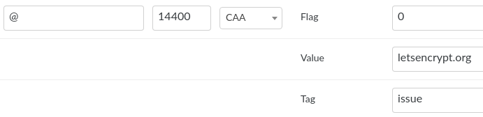

# Let's Encrypt

## Создание и настройка сертификата

на примере Mirohost и nic.ua

Для того что бы подключить Let's Encrypt сертификат в КП необходимо прейти:  
МОИ ДОМЕНЫ > Управление доменами > Выбрать домен  
Выбрать > Сертификаты SSL  
поставить галочки для ваших доменов и субдоменов (если необходимо)  
Затем нажать "Создать сертификат", подождать пока активируется сертификат и потом нажать "Включить"



## Настройки домена

Необходимо добавить CAA запись:

    CAA <flags> <tag> <value>

например:

    @             CAA 0 issue "letsencrypt.org"

    example.com.  CAA 0 issuewild "comodoca.com"



### На nic.ua

## Links

[Let's Encrypt: получение сертификата по шагам](https://habr.com/ru/post/270273/) 2015-2017

## Keys

<button>ssl</button> <button>lets encrypt</button> <button>https</button> <button>mirohost</button> <button>nic.ua</button>

